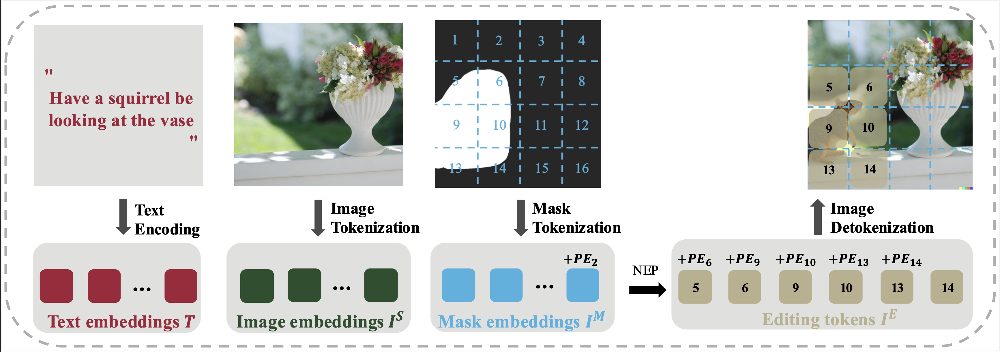

# NEP: Autoregressive Image Editing via <u>N</u>ext <u>E</u>diting Token <u>P</u>rediction


<div align="center">

[](https://arxiv.org/abs/2508.06044)&nbsp;
[](https://nep-bigai.github.io/)&nbsp;

</div>
<p align="center">

<p>

# Introduction

This is the official implementation of [NEP: Autoregressive Image Editing via <u>N</u>ext <u>E</u>diting Token <u>P</u>rediction](https://arxiv.org/abs/2508.06044).
We introduce a targeted and efficient text-guided image editing approach. Text-guided image editing involves modifying a source image based on a language instruction and, typically, requires changes to only small local regions. However, existing approaches generate the entire target image rather than selectively regenerate only the intended editing areas. This results in (1) unnecessary computational costs and (2) a bias toward reconstructing non-editing regions, which compromises the quality of the intended edits. To resolve these limitations, we propose to formulate image editing as Next Editing-token Prediction (NEP) based on autoregressive image generation, where only regions that need to be edited are regenerated, thus avoiding unintended modification to the non-editing areas. To enable any-region editing, we propose to pre-train an any-order autoregressive text-to-image (T2I) model. Once trained, it is capable of zero-shot image editing and can be easily adapted to NEP for image editing, which achieves a new state-of-the-art on widely used image editing benchmarks. Moreover, our model naturally supports test-time scaling (TTS) through iteratively refining its generation in a zero-shot manner.

# Getting Started
## Environment
```
conda create -n nep python=3.8
conda activate nep
pip install -r requirements.txt
```

## Prepare pre-trained checkpoints

1. Download pre-trained [VQ-VAE checkpoint](https://huggingface.co/peizesun/llamagen_t2i/resolve/main/vq_ds16_t2i.pt) and put it under "pretrained_models".
2. Download pre-trained [LlamaGen checkpoint](https://huggingface.co/peizesun/llamagen_t2i/resolve/main/t2i_XL_stage1_256.pt) and put it under "pretrained_models".


## Two-stage training and evaluation

### 1. RLlamaGen training
```
# set the hyperparameters
ft_epoch_num=2
init_ckpt=pretrained_models/t2i_XL_stage1_256.pt
data_paths=/home/{username}/data/dataloader_cc12m_llava_next_train_for_debug.jsonl
results_dir=specify_your_results_dir
global_batch_size=360
```

```
# start RLlamaGen training
CUDA_VISIBLE_DEVICES=0,1,2,3,4,5,6,7 torchrun --nnodes=8 \
autoregressive/train/train_t2i.py \
--vq-ckpt ./pretrained_models/vq_ds16_t2i.pt \
--data-paths $data_paths \
--init-gpt-ckpt $init_ckpt \
--results-dir $results_dir --ckpt-every 10000 --max_checkpoints 3 \
--image-size 256 --gpt-model R-GPT-XL \
--global-batch-size $global_batch_size --epochs $ft_epoch_num --lr 1e-4

```
## 
### 2. NEP training 
```
# set the hyperparameters
editing_ft_epoch_num=10
editing_init_ckpt=RLlamaGen.pt # 1st stage checkpoints
editing_data_path=path_to_ultraedit.jsonl
editing_results_dir=path_to_RLlamaGen
editing_global_batch_size=16
```

```
# start NEP training
CUDA_VISIBLE_DEVICES=0,1,2,3 torchrun --nnodes=4 \
autoregressive/train/train_editing.py \
--vq-ckpt ./pretrained_models/vq_ds16_t2i.pt \
--data-path $editing_data_path --dataset editing_ultraedit \
--init-gpt-ckpt $editing_init_ckpt --results-dir $editing_results_dir \
--image-size 256 \
--gpt-model R-GPT-XL --mask_in_context \
--global-batch-size $editing_global_batch_size --epochs $editing_ft_epoch_num --lr 1e-4 \
--validate_every -1  --ckpt-every 10000
```
## 
### 3. Evaluation
#### MagicBrush test set
1. Download MagicBrush test set following [this instruction](https://github.com/OSU-NLP-Group/MagicBrush?tab=readme-ov-file) and put it under /home/{username}/data/MagicBrush_test/ where {username} specifies your user name.
2. [Optional] Replace texutual instructions with their corresponding T5 features. 
    * Pre-extract T5 features and save them locally by refering to language/extract_t5_feature.py.

    * ```cp /home/{username}/data/MagicBrush_test/test/edit_sessions.json /home/{username}/data/MagicBrush_test/test/edit_sessions_with_instruction_t5.json```
    * Change the instructions to its path to the saved T5 features in edit_sessions_with_instruction_t5.json.
    * This step is optional if you prefer to extract T5 features on-the-fly. Remenber to remove " --with_t5_prompt" flag from the evaluation command.

#### Emu Edit test set
1. Download [Emu Edit test set](https://huggingface.co/datasets/facebook/emu_edit_test_set) and put it under /home/{username}/data/emu_edit_test_set where {username} specifies your user name.
2. Extract images from *.parquet files and save them under /home/{username}/data/emu_edit_test_set/images, which contains 3589 image files named {id}.png, eg., 0.png.
3. Construct valid ground truth image folder /home/{username}/data/emu_edit_test_set/images_valid/ by copying those with ids in assets/emu_test_data.json from /home/{username}/data/emu_edit_test_set/images. The valid image files are renamed as {id}_gt.png, eg., 0_gt.png.

```
# MagicBrush test set parameters
magicbrush_json_with_t5=/home/{username}/data/MagicBrush_test/test/edit_sessions_with_instruction_t5.json 
magicbrush_input_path=/home/{username}/data/MagicBrush_test/test/images
magicbrush_gt_path=/home/{username}/data/MagicBrush_test/test/images/
magicbrush_caption_path=/home/{username}/data/MagicBrush_test/test/local_descriptions.json


# EmuEdit test set parameters
emu_data_file=/home/{username}/data/emu_edit_test_set/data
emuedit_gt_path=/home/{username}/data/emu_edit_test_set/images_valid/
emuedit_caption_path=./assets/emu_test_data.json # the subset of valid Emu Edit files
valid_emuedit_test_data=./assets/emu_test_data.json

# Fine-tuning parameters with an image size of 512
editing_ckpt=NEP_256.pt # 2nd stage checkpoint
editing_512_results_dir=path_to_512_editing_results
editing_512_global_batch_size=16

# Evaluation on MagicBrush & EmuEdit after fine-tuning with an image size of 512
CUDA_VISIBLE_DEVICES=0,1,2,3 torchrun --nnodes=4 \
autoregressive/train/train_editing.py \
--vq-ckpt ./pretrained_models/vq_ds16_t2i.pt \
--data-path $editing_data_path --dataset editing_ultraedit \
--init-gpt-ckpt $editing_ckpt \
--results-dir $editing_512_results_dir --ckpt-every 2000 --no_epoch_save \
--image-size 512 --gpt-model GPT-XL-RAR --mask_in_context \
--global-batch-size $editing_512_global-batch-size --epochs 1 --lr 1e-5 \
--val_dataset magicbrush,emuedit_test --validate_every 2000 \
--magicbrush_json $magicbrush_json_with_t5 --with_t5_prompt \
--magicbrush_input_path $magicbrush_input_path --gt_path $magicbrush_gt_path --caption_path $magicbrush_caption_path \
--emu_data_file $emu_data_file --valid_emuedit_test_data $valid_emuedit_test_data --emuedit_gt_path $emuedit_gt_path --emuedit_caption_path $emuedit_caption_path --enforce_emu_validation_fake_masking --val-global-batch-size 16 \
--early-stop 2001

```

## Checkpoints
Our trained checkpoints of [RLlmaGen](https://huggingface.co/hmwhwm/NEP/blob/main/RLlamaGen.pt), [NEP_256]() and [NEP_512]() checkpoints are openly available.


# Acknowledgement
We would like to thank following open-source projects: [LlamaGen](https://github.com/FoundationVision/LlamaGen), [RAR](https://github.com/bytedance/1d-tokenizer) and [MagicBrush](https://github.com/OSU-NLP-Group/MagicBrush).


# Citation
If you find this work helpful to your research, please consider citing

```bibtex
@article{wu2025nep,
  title={NEP: Autoregressive Image Editing via Next Editing Token Prediction},
  author={Wu, Huimin and Ma, Xiaojian and Zhao, Haozhe and Zhao, Yanpeng and Li, Qing},
  journal={arXiv preprint arXiv:2508.06044},
  year={2025}
}
```